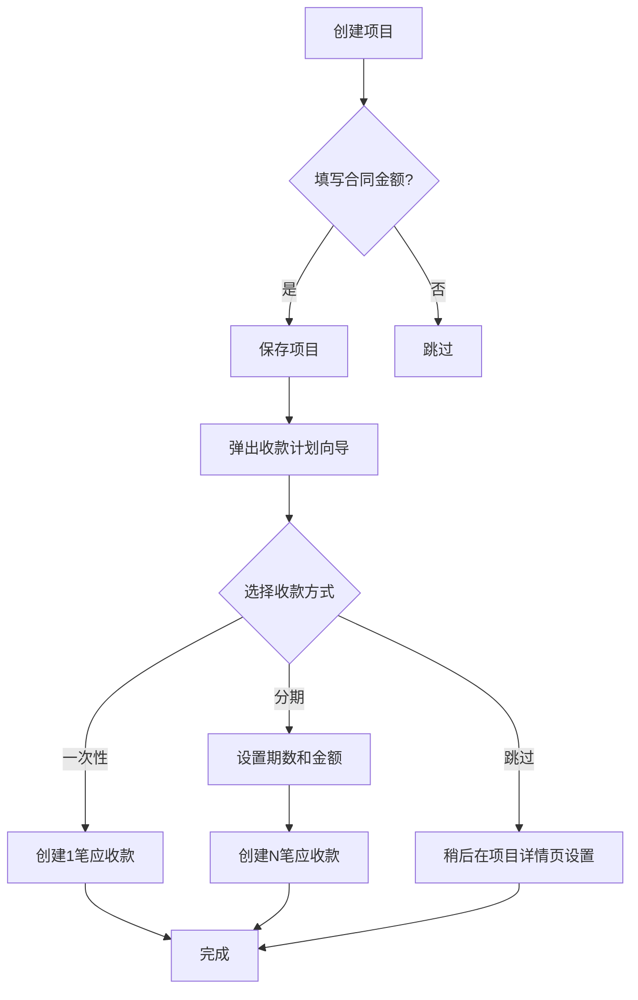
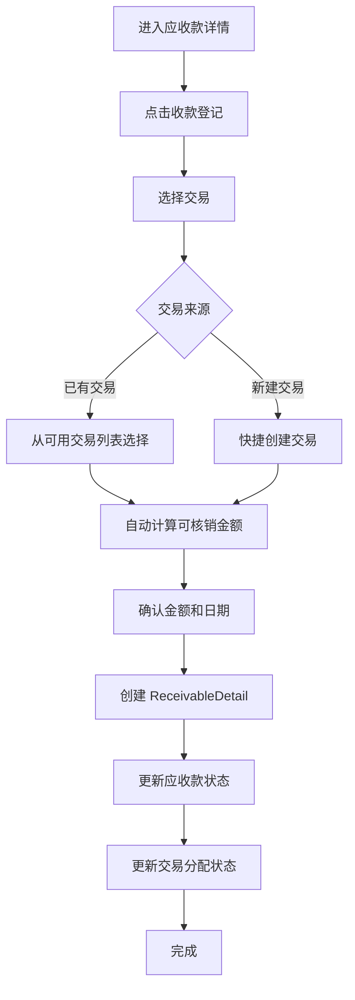
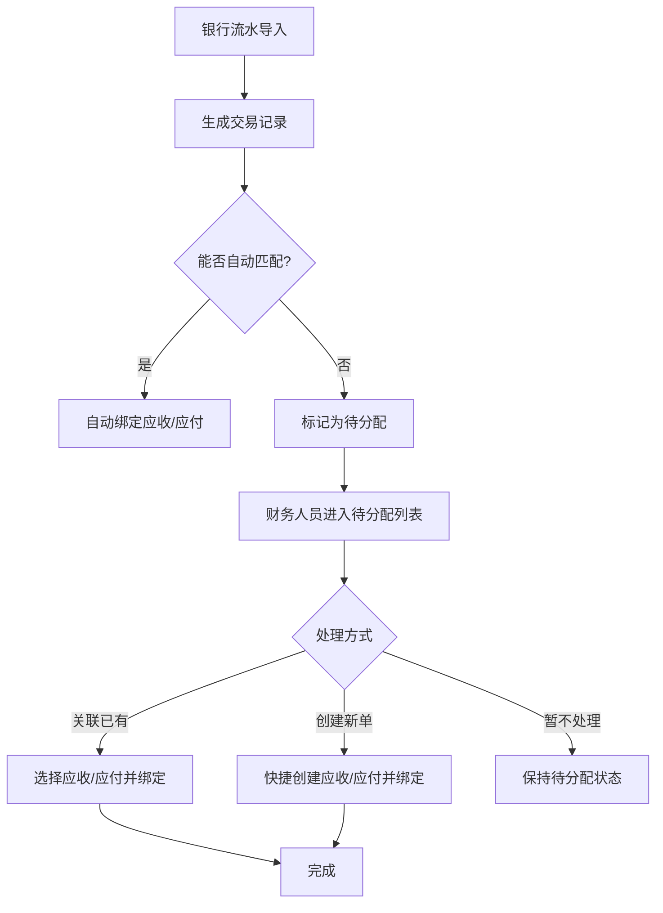

# 财务结算优化方案设计文档

## 文档信息

- **创建日期**: 2026-04-02
- **状态**: 设计中
- **相关任务**: #1, #2, #3, #4, #5, #6

## 一、方案概述

### 核心理念

**"应收由项目合同驱动形成收款计划，应付由待结算事项驱动形成付款台账，收付款都通过真实交易进行核销，项目上的已收未收、已付未付全部由台账自动汇总。"**

### 解决的核心问题

1. **数据一致性**：项目金额与应收款金额分离，容易不一致
2. **业务流程割裂**：收款登记不关联实际交易，资金流与业务流脱节
3. **灵活性不足**：业务顺序颠倒（钱先到，合同后签）会卡住流程
4. **计算口径混乱**：项目汇总数据来源不统一

## 二、核心设计

### 2.1 数据模型调整

#### 交易分配状态

```csharp
public enum AllocationStatus
{
    Unallocated = 0,          // 未分配
    PartiallyAllocated = 1,   // 部分分配
    FullyAllocated = 2        // 完全分配
}

// Transaction 实体增加
public class Transaction : BaseEntity
{
    // ... 现有字段
    public AllocationStatus AllocationStatus { get; set; } = AllocationStatus.Unallocated;
    
    // 计算可用余额
    public decimal GetAvailableAmount()
    {
        var allocatedAmount = Details.Sum(d => d.Amount);
        return Amount - allocatedAmount;
    }
}
```

#### 应付款业务类型（主数据）

```csharp
public class PayableType : BaseEntity
{
    public string Name { get; set; } = string.Empty;
    public string? Code { get; set; }
    public string? Description { get; set; }
    public bool IsActive { get; set; } = true;
    public int SortOrder { get; set; }
}

public class Payable : BaseEntity
{
    // ... 现有字段
    public long? PayableTypeId { get; set; }
    public PayableType? PayableType { get; set; }
}
```

**预置业务类型**：
- 项目成本支出
- 人员费用
- 人员开发费用成本
- 外包费用
- 其他

### 2.2 计算口径统一

#### 应收款计算

```csharp
// 已收金额 = 明细表汇总
receivedAmount = SUM(receivable_details.amount)

// 剩余金额 = 总金额 - 已收金额
remainingAmount = totalAmount - receivedAmount

// 状态判断
status = receivedAmount == 0 ? Pending 
       : receivedAmount < totalAmount ? Partial 
       : Settled

// 逾期判断
overdue = dueDate < today && remainingAmount > 0
```

#### 应付款计算

```csharp
// 已付金额 = 明细表汇总
paidAmount = SUM(payable_details.amount)

// 剩余金额 = 总金额 - 已付金额
remainingAmount = totalAmount - paidAmount

// 状态判断
status = paidAmount == 0 ? Pending 
       : paidAmount < totalAmount ? Partial 
       : Settled

// 逾期判断
overdue = dueDate < today && remainingAmount > 0
```

#### 项目汇总计算

```csharp
// 计划应收 = 项目下所有应收款总额
plannedReceivable = SUM(project.receivables.totalAmount)

// 已收 = 项目下所有应收款明细汇总
received = SUM(project.receivables.details.amount)

// 未收 = 项目下所有应收款剩余金额
unreceived = SUM(project.receivables.remainingAmount)

// 计划应付 = 项目下所有应付款总额
plannedPayable = SUM(project.payables.totalAmount)

// 已付 = 项目下所有应付款明细汇总
paid = SUM(project.payables.details.amount)

// 未付 = 项目下所有应付款剩余金额
unpaid = SUM(project.payables.remainingAmount)
```

#### 交易可用余额

```csharp
// 收入交易可核销金额
availableAmount = transaction.amount - SUM(receivable_details.amount WHERE transaction_id = transaction.id)

// 支出交易可核销金额
availableAmount = transaction.amount - SUM(payable_details.amount WHERE transaction_id = transaction.id)
```

### 2.3 约束规则

1. **收支分离**：收入交易只能绑定应收，支出交易只能绑定应付
2. **互斥约束**：同一笔交易不可同时绑定应收和应付
3. **金额约束**：
   - 任一交易累计核销金额 ≤ 交易金额
   - 任一应收/应付累计核销金额 ≤ 剩余金额
4. **状态约束**：已结清的应收/应付不允许继续核销

## 三、业务流程设计

### 3.1 收款计划管理流程



### 3.2 收款登记流程（新）



### 3.3 待分配交易处理流程



## 四、界面设计

### 4.1 收款计划初始化向导

```
┌─────────────────────────────────────────────┐
│ 初始化收款计划                               │
├─────────────────────────────────────────────┤
│ 项目：XXX项目                                │
│ 合同金额：¥1,000,000                        │
│                                             │
│ 收款方式：                                   │
│ ○ 一次性收款                                 │
│ ● 分期收款                                   │
│                                             │
│ 期数：[3 ▼]                                 │
│                                             │
│ ┌─────────────────────────────────────────┐ │
│ │ 期次    金额(¥)      比例    到期日     │ │
│ │ 首付    300,000     30%    [2026-05-01]│ │
│ │ 进度款  400,000     40%    [2026-08-01]│ │
│ │ 尾款    300,000     30%    [2026-12-01]│ │
│ │                                         │ │
│ │ 合计：¥1,000,000 ✓                      │ │
│ └─────────────────────────────────────────┘ │
│                                             │
│ 快捷模板：                                   │
│ [30-40-30] [50-50] [按月均分] [自定义]      │
│                                             │
│ [跳过] [确定]                                │
└─────────────────────────────────────────────┘
```

### 4.2 项目详情页 - 收款计划 Tab

```
┌─────────────────────────────────────────────┐
│ 项目详情 - XXX项目                           │
├─────────────────────────────────────────────┤
│ [基本信息] [收款计划] [成本支出] [利润分析] │
├─────────────────────────────────────────────┤
│                                             │
│ 收款计划汇总                                 │
│ ┌─────────────────────────────────────────┐ │
│ │ 计划应收：¥1,000,000                    │ │
│ │ 已收：¥300,000 (30%)                    │ │
│ │ 未收：¥700,000 (70%)                    │ │
│ └─────────────────────────────────────────┘ │
│                                             │
│ [+ 新增应收款] [初始化收款计划]              │
│                                             │
│ ┌─────────────────────────────────────────┐ │
│ │ 期次  金额      已收    未收    到期日   │ │
│ │ 首付  300,000  300,000  0      已结清   │ │
│ │ 进度  400,000  0       400,000 2026-08  │ │
│ │ 尾款  300,000  0       300,000 2026-12  │ │
│ └─────────────────────────────────────────┘ │
│                                             │
└─────────────────────────────────────────────┘
```

### 4.3 收款登记对话框（改造）

```
┌─────────────────────────────────────────────┐
│ 收款登记                                     │
├─────────────────────────────────────────────┤
│ 应收款：首付款 - ¥300,000                   │
│ 剩余未收：¥300,000                          │
│                                             │
│ 选择交易：                                   │
│ ┌─────────────────────────────────────────┐ │
│ │ [搜索交易...]                            │ │
│ │                                         │ │
│ │ 2026-04-01  收入  ¥350,000  可用:350,000│ │
│ │ 2026-03-28  收入  ¥200,000  可用:200,000│ │
│ │ 2026-03-25  收入  ¥150,000  可用:50,000 │ │
│ └─────────────────────────────────────────┘ │
│                                             │
│ 或 [+ 快捷创建新交易]                        │
│                                             │
│ 收款金额：¥300,000 (自动计算)               │
│ 收款日期：[2026-04-01]                      │
│ 收款方式：[银行转账 ▼]                      │
│ 备注：[可选]                                 │
│                                             │
│ [取消] [确定]                                │
└─────────────────────────────────────────────┘
```

### 4.4 待分配交易列表页（新增）

```
┌─────────────────────────────────────────────┐
│ 待分配交易                                   │
├─────────────────────────────────────────────┤
│ 筛选：[收入▼] [全部日期▼] [搜索...]         │
│                                             │
│ ┌─────────────────────────────────────────┐ │
│ │ 日期      类型  金额      可用    操作   │ │
│ │ 04-01    收入  350,000   350,000 [处理] │ │
│ │ 03-28    收入  200,000   200,000 [处理] │ │
│ │ 03-25    支出  80,000    80,000  [处理] │ │
│ └─────────────────────────────────────────┘ │
│                                             │
│ [批量标记为待分配收款] [批量标记为待分配付款]│
└─────────────────────────────────────────────┘

点击 [处理] 弹出：
┌─────────────────────────────────────────────┐
│ 处理待分配交易                               │
├─────────────────────────────────────────────┤
│ 交易：2026-04-01 收入 ¥350,000              │
│                                             │
│ 处理方式：                                   │
│ ● 关联已有应收款                             │
│ ○ 创建新应收款并绑定                         │
│ ○ 暂不处理                                   │
│                                             │
│ 选择应收款：                                 │
│ ┌─────────────────────────────────────────┐ │
│ │ [搜索...]                                │ │
│ │                                         │ │
│ │ XXX项目-首付  剩余:300,000              │ │
│ │ YYY项目-尾款  剩余:200,000              │ │
│ └─────────────────────────────────────────┘ │
│                                             │
│ 核销金额：¥300,000                          │
│                                             │
│ [取消] [确定]                                │
└─────────────────────────────────────────────┘
```

## 五、数据迁移方案

### 5.1 迁移策略

采用**三阶段迁移**：自动迁移 → 检查 → 手动修复

#### 阶段 1：自动迁移（SQL 脚本）

```sql
-- 1. 为交易计算分配状态
UPDATE transactions t
SET allocation_status = CASE
    WHEN (
        SELECT COALESCE(SUM(rd.amount), 0) 
        FROM receivable_details rd 
        WHERE rd.transaction_id = t.id
    ) + (
        SELECT COALESCE(SUM(pd.amount), 0) 
        FROM payable_details pd 
        WHERE pd.transaction_id = t.id
    ) >= t.amount THEN 2  -- FullyAllocated
    WHEN (
        SELECT COALESCE(SUM(rd.amount), 0) 
        FROM receivable_details rd 
        WHERE rd.transaction_id = t.id
    ) + (
        SELECT COALESCE(SUM(pd.amount), 0) 
        FROM payable_details pd 
        WHERE pd.transaction_id = t.id
    ) > 0 THEN 1  -- PartiallyAllocated
    ELSE 0  -- Unallocated
END;

-- 2. 为未关联交易的收款记录创建虚拟交易
INSERT INTO transactions (
    transaction_date, amount, transaction_type, 
    transfer_direction, account_id, description, 
    status, is_allocated, created_at, updated_at
)
SELECT 
    rd.payment_date,
    rd.amount,
    1, -- Income
    1, -- In
    (SELECT id FROM accounts WHERE is_default = true LIMIT 1),
    CONCAT('历史收款补录 - ', r.description),
    1, -- Confirmed
    true,
    NOW(),
    NOW()
FROM receivable_details rd
JOIN receivables r ON rd.receivable_id = r.id
WHERE rd.transaction_id IS NULL;

-- 3. 更新 receivable_details 关联到新创建的交易
-- (需要根据实际情况编写匹配逻辑)

-- 4. 初始化应付款业务类型
INSERT INTO payable_types (name, code, sort_order, is_active, created_at, updated_at)
VALUES 
    ('项目成本支出', 'PROJECT_COST', 1, true, NOW(), NOW()),
    ('人员费用', 'PERSONNEL_EXPENSE', 2, true, NOW(), NOW()),
    ('人员开发费用成本', 'DEV_PERSONNEL_COST', 3, true, NOW(), NOW()),
    ('外包费用', 'OUTSOURCING_FEE', 4, true, NOW(), NOW()),
    ('其他', 'OTHER', 99, true, NOW(), NOW());
```

#### 阶段 2：数据一致性检查

开发检查工具，扫描以下问题：

1. **项目金额不一致**
   ```sql
   SELECT p.id, p.name, p.contract_amount,
          COALESCE(SUM(r.total_amount), 0) as receivable_total
   FROM projects p
   LEFT JOIN receivables r ON r.project_id = p.id
   GROUP BY p.id
   HAVING p.contract_amount != COALESCE(SUM(r.total_amount), 0);
   ```

2. **应收款金额不一致**
   ```sql
   SELECT r.id, r.total_amount, r.received_amount,
          COALESCE(SUM(rd.amount), 0) as detail_total
   FROM receivables r
   LEFT JOIN receivable_details rd ON rd.receivable_id = r.id
   GROUP BY r.id
   HAVING r.received_amount != COALESCE(SUM(rd.amount), 0);
   ```

3. **未关联交易的明细**
   ```sql
   SELECT * FROM receivable_details WHERE transaction_id IS NULL;
   SELECT * FROM payable_details WHERE transaction_id IS NULL;
   ```

#### 阶段 3：手动修复工具

提供管理界面，支持：
- 查看问题数据列表
- 批量修复操作
- 逐条审核和调整

### 5.2 迁移时间窗口

建议在**业务低峰期**（如周末）执行：
1. 备份数据库
2. 执行自动迁移脚本（预计 10-30 分钟）
3. 运行一致性检查（预计 5-10 分钟）
4. 通知财务人员使用修复工具处理问题数据（1-2 天）

## 六、实施计划

### Phase 1: 数据模型和计算口径调整（5 天）
- 交易表增加 `AllocationStatus`
- 实现交易可用余额计算
- 项目汇总改为从台账计算
- 数据库迁移

### Phase 2: 收款/付款登记改为交易绑定模式（7 天）
- `TransactionId` 改为必填
- 前端增加"选择交易"功能
- 金额自动计算
- 明细表显示交易链接

### Phase 3: 待分配交易管理（5 天）
- 新增待分配交易列表页
- 支持快捷创建应收/应付并绑定
- 批量标记功能

### Phase 4: 项目收款计划管理（9 天）
- 项目页增加"收款计划" Tab
- 初始化收款计划向导
- 应收款拆分功能
- 快捷模板

### Phase 5: 应付款业务类型和流程完善（5 天）
- 新增 `PayableType` 主数据
- 业务类型管理页
- 应付款列表优化

### Phase 6: 数据迁移和兼容性处理（5 天）
- 数据迁移脚本
- 一致性检查工具
- 手动修复工具
- 文档更新

**总计：36 天**

## 七、风险和应对

### 7.1 数据迁移风险

**风险**：历史数据复杂，自动迁移可能出错

**应对**：
- 在测试环境充分测试
- 提供回滚方案
- 分阶段迁移，先检查再修复

### 7.2 用户习惯改变

**风险**：用户习惯了旧流程，新流程需要培训

**应对**：
- 提供详细操作手册
- 录制操作视频
- 提供在线帮助和提示

### 7.3 性能问题

**风险**：汇总计算可能影响性能

**应对**：
- 为关键字段添加索引
- 考虑引入缓存机制
- 大数据量时使用分页和异步加载

## 八、后续优化方向

1. **智能匹配**：根据金额、日期、对方自动匹配交易和应收/应付
2. **收款提醒**：到期日前自动提醒
3. **账龄分析**：更详细的应收账龄报表
4. **现金流预测**：基于收款计划预测未来现金流
5. **移动端支持**：移动端快速审批收款/付款

## 九、参考资料

- 现有代码：`backend/FinanceApp.Application/Modules/FinanceSettlement/`
- 相关文档：`docs/01_Product/02_modules_and_rules.md`
- 任务列表：#1, #2, #3, #4, #5, #6
